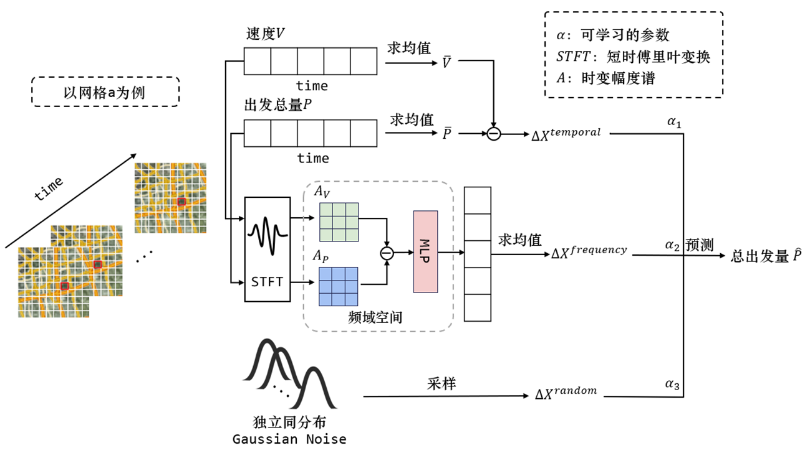

# README

## Our method

## Get started fast

### 1. Environment dependency installation

conda create-n your_env_name python=3.8

conda activate your_env_name

pip install -r requirements.txt

### 2. Data processing

The original data should be placed in the `data/originalData` directory, and the processed data will be output to `data/dataset`.

You need to configure the parameters, see `utils/data_process.py` for details.

python utils/data_process.py

### 3. Train & Test

python main.py --infer_type testing

### 4. Real-time inference

python main.py --infer_type realtime

You need to prepare the required input samples in the form of `[N,]` and store them in the `data/realtimeInput` directory.

### 5. Visualize

Output to the `figure` directory

## 关系等式构建

## 快速开始

### 1. 环境依赖安装

conda create -n your_env_name python=3.8

conda activate your_env_name

pip install -r requirements.txt

### 2. 数据处理

原始数据应放置在 `data/originalData/` 目录中，处理后数据输出到 `data/dataset/` 

你需要配置相应的参数设置，具体请查看`utils/data_process.py` 

python utils/data_process.py

### 3. 训练&测试

python main.py --infer_type testing

### 4. 实时推理

模型训练完成后可执行实时推理

python main.py --infer_type realtime

你需要准备所需要的输入样本，形式为`[N, ]`，存放在`data/realtimeInput`目录下

### 5.可视化

输出到`figure`目录下